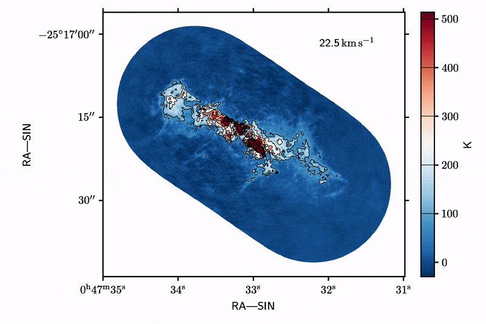

# Installation

For now just download the package and append it to your path.
```
import sys
sys.path.append('/path/you/downloaded/cube2movie/to/')
```


## Requirements
python: numpy, matplotlib, astropy, SpectralCube

ffmpeg

After installing ffmpeg, it may be necessary to explicitly set the path to ffmpeg so matplotlib can find it.
Set `plt.rcParams['animation.ffmpeg_path'] = '/usr/bin/ffmpeg'` to the appropriate path returned by `which ffmpeg` in this case `/usr/bin/ffmpeg`.
In most cases, it should work right out of the box.

# Usage

After adding the package location to your path (see Installation), just import cube2movie and run the cube2movie function.
```
import cube2movie as c2m
c2m.cube2movie('cube.fits')
```



## Full set of customizeable options

Also see the detailed explanations in the help `? c2m.cube2movie`.
```
cube2movie(cube,                          # image cube to convert to movie
    channels         = [],                # list of channels to plot
    # figure options
    figsize          = (8,8),             # figure size in inches
    vmin             = None,              # color range min
    vmax             = None,              # color range max
    percentiles      = [0.25, 99.75],     # percentile to determine vmin/vmax
    cmap             = 'RdBu_r',          # colormap
    imshow_kwargs    = {},                # further kwargs to ax.imshow
    xlabel           = 'auto',            # x axis label
    ylabel           = 'auto',            # y axis label
    # contour options
    contourlevels    = [],                # contour in units of image
    contour_kwargs   = {},                # further kwargs to ax.contour
    # channel label options
    decimals         = 1,                 # decimal place for channel velocity/frequency
    channelunit      = 'auto',            # to use e.g. km/s when the image header is 'm/s'
    channel_kwargs   = {},                # further kwargs to ax.text
    # colorbar
    show_cbar        = True,              # enable/disable colorbar
    cbarlabel        = 'auto',            # colorbar label
    cbar_kwargs      = {},                # further kwargs to fig.colorbar
    # movie options
    out              = 'movie.mp4',       # file name for movie
    fps              = 2,                 # frames (channels displayed) per second
    dpi              = None,              # video resolution
    bitrate          = None,              # video bitrate in kb/s
    codec            = 'h264',            # video codec to encode movie
    movie_kwargs     = {},                # further kwargs to mpl.animation.save
    # preview options
    preview_movie    = False,             # enable/disable preview of the movie in mpl window
    repeat           = False,             # repeat the preview indefinitely
    animation_kwargs = {}                 # further keywords to mpl.animation.FuncAnimation
    )
```

# Known Problems

- First frame is not correctly set. For some reason, tight_layout only works from the second frame on even if init_func is set.


# To Do

- [ ] Add option to select the channels to be plotted instead of using the full cube. This should work with channel numbers, frequencies and velocities. The conversion between them is simple with the header information.
- [ ] Add option to resample the cube, e.g. sum up five channels to get fewer frames with more action per frame.
- [ ] Add option for static overlays such as contours that do not change from frame to frame.
- [ ] Find out why the static parts of the plots (axes, labels) occasionally jitter a tiny bit. Compression artefact?
